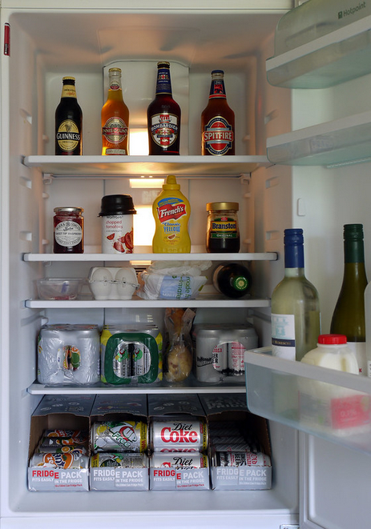
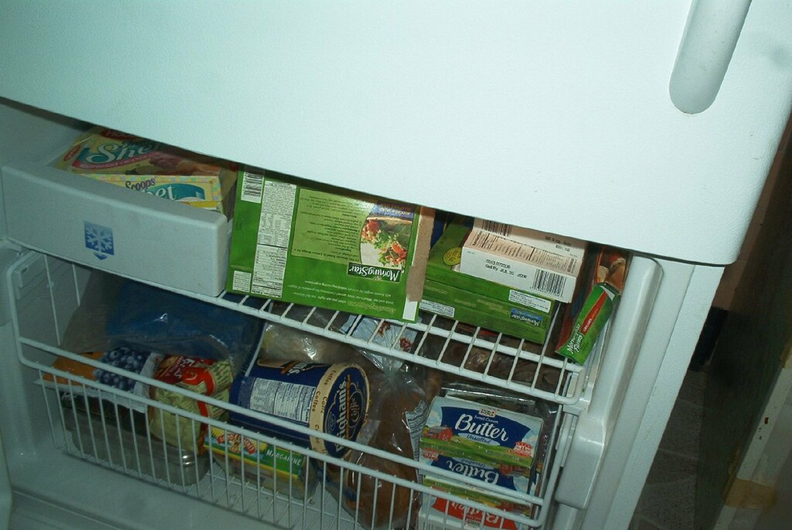

# Overview

Organizing a fridge should be based on how much available space is in your fridge, how many people are living in the household, and the amount of food that is consumed within a short amount of time (usually a week). The more people living in the household, the more food that is consumed within a duration of time. This means that you need to buy a lot more food, and you likely don't know how to organize it to have proper access to everything you want to put in the fridge. This guide will attempt to help make this problem a bit easier.

"My Fridge - Interior" by Brett Jordan is licensed under CC BY 2.0. To view a copy of this license, visit https://creativecommons.org/licenses/by/2.0/?ref=openverse.

# The essentials

The first thing you need to make sure your fridge has, are the essentials. These are the things that your family uses the most of, and are often put into the dishes that are cooked or eaten with them. Examples of this include bread, milk, vegetables (like tomatoes, lettuce, carrots, onions, etc...), cheese, and butter. These are usually things you would place in different categories. The cheese and butter can go on the side of the fridge, or on the top, while the vegetables can go into the bottom trays of a fridge. The milk goes in the middle shelf of the fridge, near the back of it and the bread goes on the top shelf of the fridge.

# Condiments

Food is hard to eat iwthout condiments that are able to make it taste so much better. Examples of condiments include salsa, ketchup, mayonnaise, mustard, ranch, tabasco sauce, etc... Condiments usually go onto the side of the fridge for easy access when grabbing them right before eating. This makes sure that nothing spills out from the middle of the fridge while rummaging quickly before the food gets cold. 

# Drinks

Drinks are used very often, so they need to be put into places that are not too cluttered or full so that nothing spills or falls out. This is why drinks tend to go in the middle shelf of the fridge, right in front of, or near, the milk. You should keep all of the drinks organized into neat rows so that more drinks are able to fit in that amount of space. If needed, buying small plastic containers to stack drinks inside of can help to organize this area while also maximizing the amount of drinks that can fit into the fridge at one time. These small plastic containers can be found [here].

# Freezer

The freezer, unlike the fridge, isn't too hard to organize. Anything that is a snack/dessert, like ice cream or frozen waffles, go on the top shelf of the freezer. This also includes items like popsicles, as well as ice packs in case of any injury requiring quick treatment. Anything else, such as frozen pizzas or similar items, go on the bottom shelf of the freezer (or whichever shelf is bigger). Any remaining space can be used for ice cubes if desired, but some freezers may have automatic ice makers so this may not be needed.

"freezer interior" by girl_named_fred is licensed under CC BY 2.0. To view a copy of this license, visit https://creativecommons.org/licenses/by/2.0/?ref=openverse.

[here]:https://www.walmart.com/ip/InterDesign-Fridge-Binz-Water-Bottle-Holder-Clear/38413024?wmlspartner=wlpa&selectedSellerId=102526002 
[https://creativecommons.org/licenses/by/2.0/?ref=openverse.]:https://creativecommons.org/licenses/by/2.0/?ref=openverse.
[https://creativecommons.org/licenses/by/2.0/?ref=openverse}]:https://creativecommons.org/licenses/by/2.0/?ref=openverse
